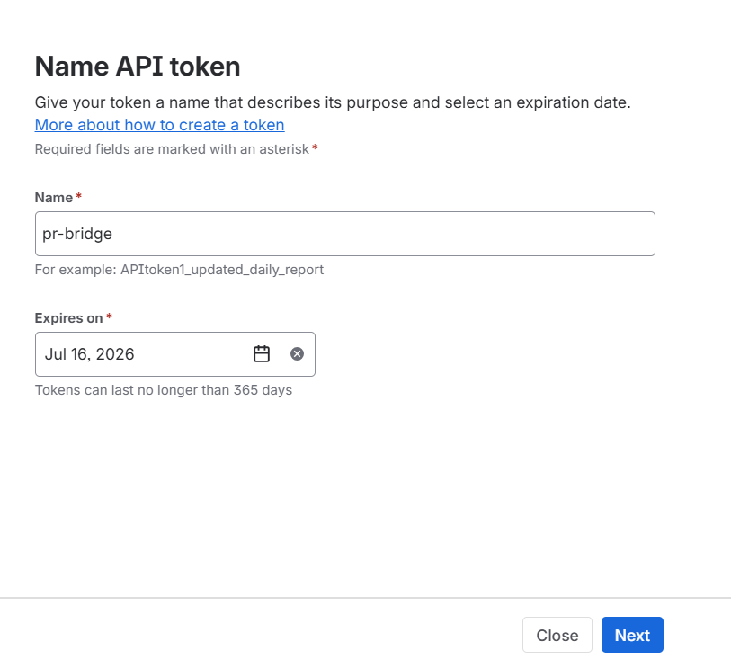
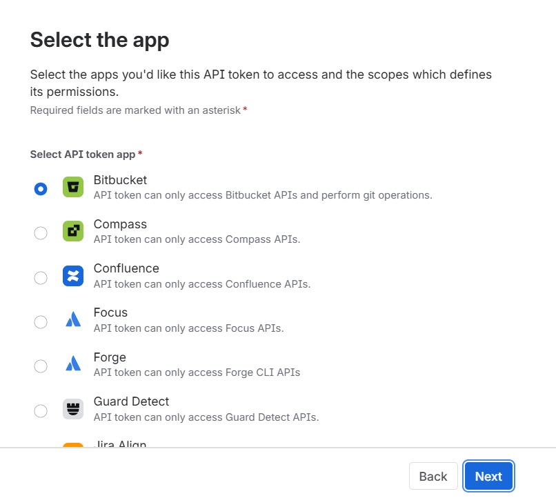
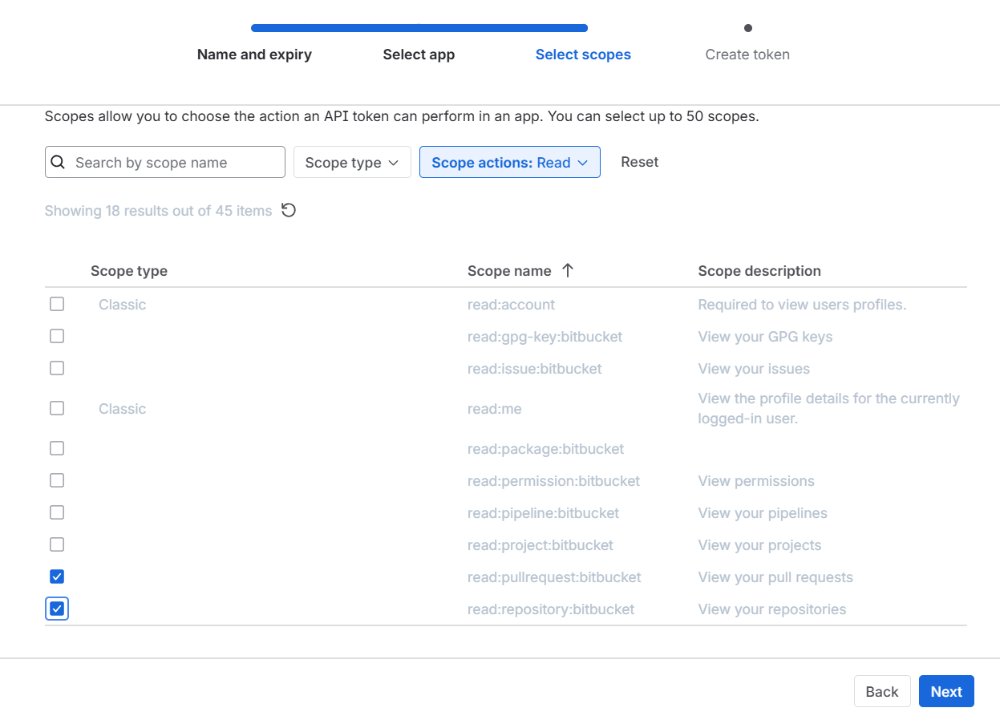
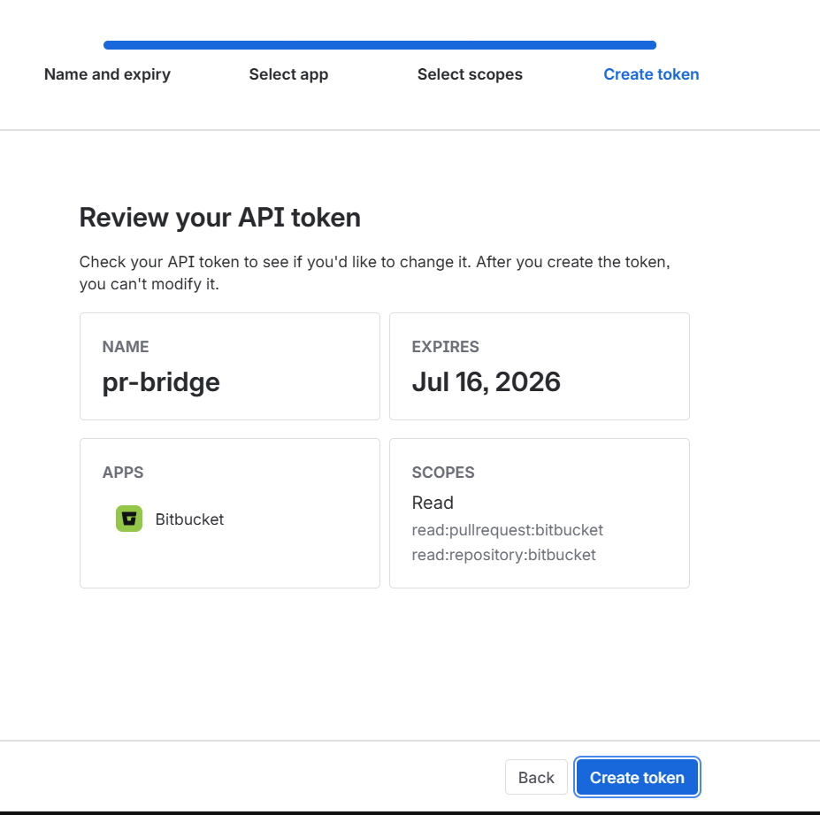

# pr-bridge

Version 1.1.0

> Export GitHub and Bitbucket Cloud PR review comments to an AI-friendly Markdown file, so your AI coding assistant gets the full context without manual copy-paste.

## The Problem

When working with an AI assistant on a pull request, explaining reviewer feedback is tedious:

- You copy-paste comments manually
- The AI has no context about which line the comment refers to
- You lose the diff context
- Threading and replies are hard to follow

**pr-bridge** solves this by fetching PR review data and formatting it into a structured Markdown file that any AI agent can read directly.

## Supported Providers

| Provider | URL format | Auth |
|----------|------------|------|
| GitHub | `https://github.com/owner/repo/pull/123` | GitHub CLI (`gh`) |
| Bitbucket Cloud | `https://bitbucket.org/workspace/repo_slug/pull-requests/123` | Bitbucket Cloud REST API token |

Bitbucket Server/Data Center is not supported yet.

## Requirements

- Python 3.11+
- [GitHub CLI (`gh`)](https://cli.github.com/) for GitHub PRs (optional if you store a token with `pr-bridge auth github`)
- A Bitbucket Cloud API token for Bitbucket PRs
- [uv](https://docs.astral.sh/uv/) only if installing directly from GitHub

## Authentication

The recommended way to authenticate is the built-in `auth` command. It prompts
for your credentials and stores them in a cross-platform config file, so you do
**not** have to set environment variables (which differ between PowerShell, cmd,
and POSIX shells):

```bash
pr-bridge auth bitbucket
pr-bridge auth github
```

Secrets are entered hidden and saved with owner-only permissions to:

| OS | Location |
|----|----------|
| Windows | `%APPDATA%\pr-bridge\credentials.json` |
| macOS / Linux | `$XDG_CONFIG_HOME/pr-bridge/credentials.json` (default `~/.config/pr-bridge/credentials.json`) |

### Generating a Bitbucket Cloud API token

Bitbucket serves the PR diff from the repository, so the token needs **both** of
these Read scopes — a common gotcha is granting only `read:pullrequest`, which
lets comments through but returns `403` on the diff:

- `read:pullrequest:bitbucket`
- `read:repository:bitbucket`

Create the token at
[id.atlassian.com → Security → API tokens](https://id.atlassian.com/manage-profile/security/api-tokens):

1. **Name and expiry** — give it a name (e.g. `pr-bridge`) and an expiry date.

   

2. **Select app** — choose **Bitbucket**.

   

3. **Select scopes** — check both `read:pullrequest:bitbucket` **and**
   `read:repository:bitbucket`.

   

4. **Create token** — review and create. Copy the token (you can't view it again).

   

Then run `pr-bridge auth bitbucket` and paste your Atlassian account email and
the token.

> **Note:** API tokens are immutable — you can't add a scope to an existing
> token. If a token is missing `read:repository:bitbucket`, create a new one.

### Environment variables (alternative / CI)

Environment variables still work and take precedence over the stored file, which
is handy for CI:

```bash
# Bitbucket Cloud API token
export BITBUCKET_EMAIL="you@example.com"
export BITBUCKET_API_TOKEN="your-api-token"

# Or a Bitbucket OAuth/access token
export BITBUCKET_ACCESS_TOKEN="your-access-token"

# GitHub (also honored by the gh CLI)
export GH_TOKEN="your-github-token"
```

For GitHub you can alternatively just run `gh auth login`.

## Installation

### From PyPI

```bash
pip install pr-bridge
```

Or with `uv`:

```bash
uv tool install pr-bridge
```

### From GitHub

```bash
uv tool install git+https://github.com/filipembedded/pr-bridge.git

git clone https://github.com/filipembedded/pr-bridge.git
cd pr-bridge
uv tool install -e .
```

Install `uv` if you do not have it yet:

```bash
curl -LsSf https://astral.sh/uv/install.sh | sh
```

## Usage

```bash
# One-time: store credentials (see Authentication above)
pr-bridge auth bitbucket
pr-bridge auth github

# Fetch all review comments for a GitHub PR
pr-bridge fetch https://github.com/owner/repo/pull/123

# Fetch all review comments for a Bitbucket Cloud PR
pr-bridge fetch https://bitbucket.org/workspace/repo_slug/pull-requests/123

# Fetch only unresolved/open threads
pr-bridge fetch https://bitbucket.org/workspace/repo_slug/pull-requests/123 --filter unresolved

# Save output to a specific directory
pr-bridge fetch https://github.com/owner/repo/pull/123 --output ./reviews/

# Save to a specific file
pr-bridge fetch https://bitbucket.org/workspace/repo_slug/pull-requests/123 --output my-review.md

# Exclude general (non-inline) comments
pr-bridge fetch https://github.com/owner/repo/pull/123 --no-general
```

The output file is saved as `pr-<NUMBER>-<owner>-<repo>.md` in the current directory, unless you provide a different output path.

## Output Format

The generated Markdown is structured for AI consumption:

````markdown
# PR #123: Fix something important

- Repository: owner/repo
- Author: @someone
- State: open
- Branch: `fix/something` -> `main`

## Review Summaries
- @reviewer - `CHANGES_REQUESTED` (2024-01-15)

## Inline Review Comments

---
## File: `src/main.c`

### Thread 1 - `src/main.c` (line 42) [**OPEN**]

**Diff context:**
```diff
+int foo() {
+    return bar;
+}
```

**@reviewer** (member) - 2024-01-15
[view on GitHub](https://github.com/...)

This function is never called. Consider removing it.
````

For Bitbucket output, provider links are rendered as `view on Bitbucket`.

## Options

| Option | Description |
|--------|-------------|
| `--filter all` | Show all threads (default) |
| `--filter unresolved` | Show only unresolved/open threads |
| `--output PATH` | Output directory or file (default: current directory) |
| `--no-general` | Exclude general PR comments |
| `--version` | Show version |

## How It Works

1. Parses the PR URL and detects GitHub or Bitbucket Cloud.
2. For GitHub, uses `gh api` to fetch inline comments, general comments, and review summaries.
3. For Bitbucket Cloud, uses the REST API to fetch PR metadata, comments, participants, and diff context.
4. Groups inline comments into threads.
5. Renders everything as structured Markdown.
6. Saves the file locally for your AI assistant to read.

For GitHub unresolved filtering is inferred from replies because the GitHub REST endpoint used here does not expose thread resolution. For Bitbucket Cloud, unresolved filtering uses Bitbucket's comment thread resolution data.

## Contributing

Contributions are welcome. Please open an issue or pull request on GitHub.

## License

MIT
